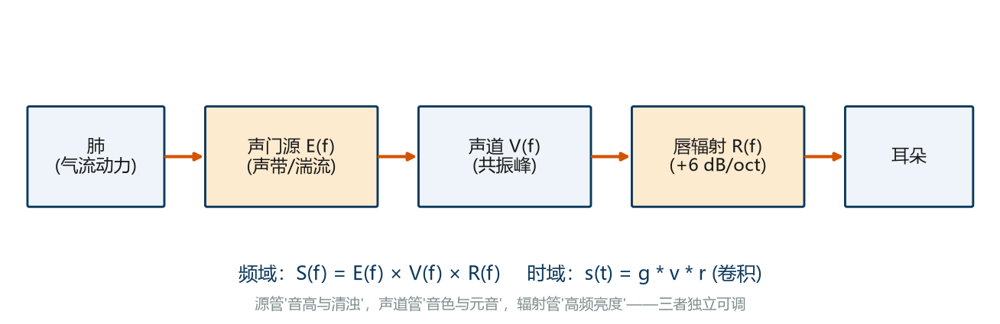
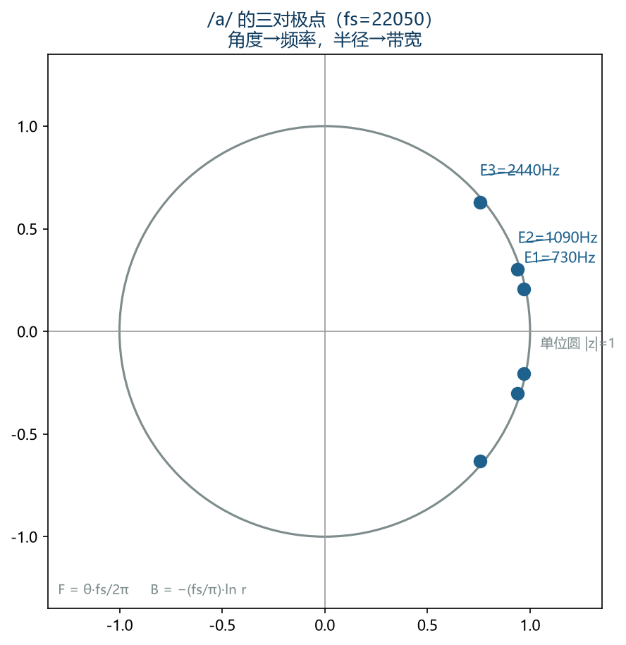
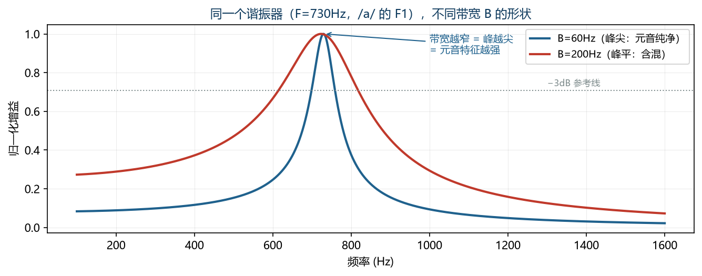
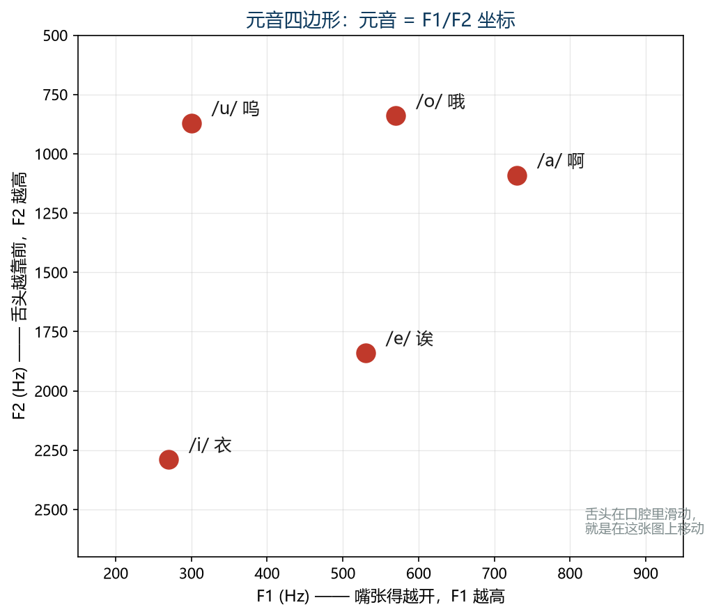
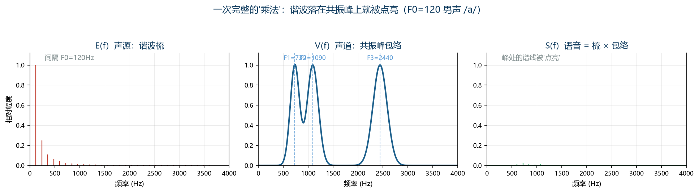
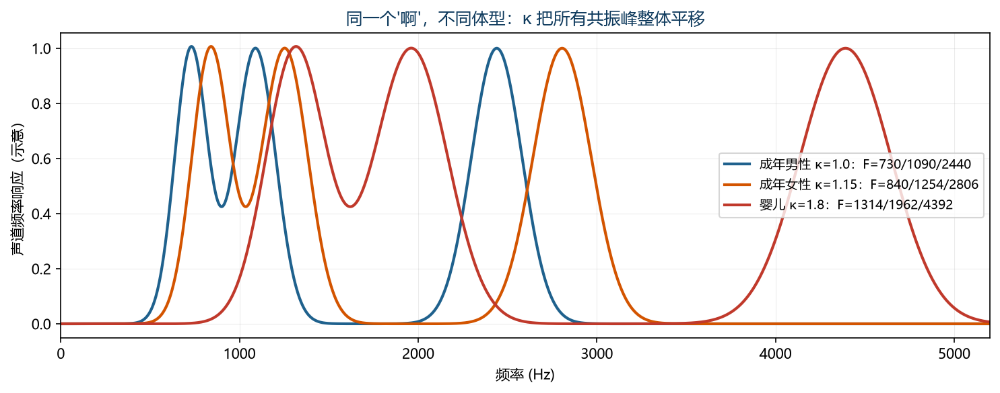
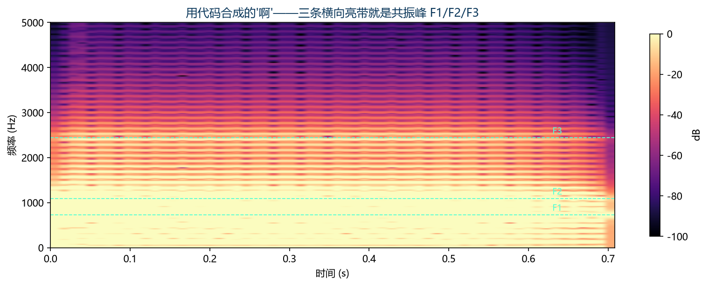
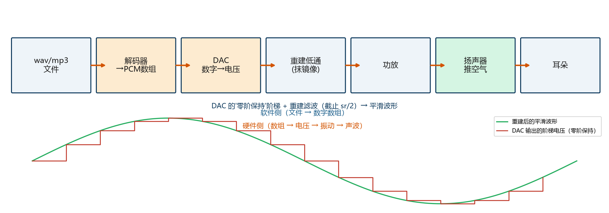
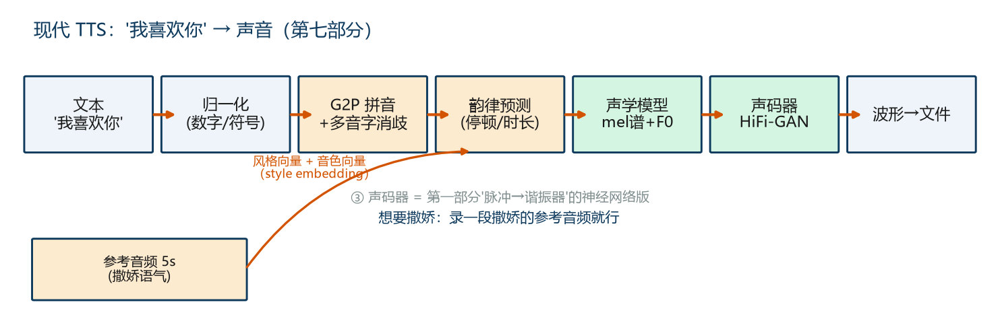

# 人声合成与播放全流程详解

> **读懂条件**：熟悉傅里叶变换、采样定理、频谱/声谱图（即主教程第 1~6 章的知识层）。
> **本章回答五个问题**：
> 1. 一个"典型人声"在数学上是什么结构？（**含 Source–Filter 模型深度讲义与微调配方**）
> 2. 怎么一步步用代码构造出人声？
> 3. 成型的数字波形怎么变成音频文件？
> 4. 音频文件又怎么变成你耳朵里的声音？
> 5. 业界（电话、TTS、变声器、录音棚、游戏）实际都是怎么玩的？
> 6. 除了人声——钢琴、鼓、风、雨、雷、引擎、警报器、激光枪…这些声音的配方是什么？（第六部分）
> 7. 现代的"我喜欢你"是怎么从文本变成声音的？撒娇音色业界怎么做？（第七部分，含免费实战）
>
> **终极一句话**：人声 = **声源（source）× 声道滤波（filter）**；播放 = **文件 → 解码出 PCM → DAC 变成电压 → 扬声器推空气**。
>
> **学习方法**：公式都不许只"看"，要拿纸笔配具体数字推一遍（本书每个公式都配了数值例子）。

---

# 第一部分 人声的解剖：Source–Filter 模型（深度讲义）

> 这部分是"理论心脏"。先立一个事实：**后面所有公式，最终都折叠进一个式子**：
>
> **S(f) = E(f) · V(f) · R(f)**
>
> 声源频谱 × 声道频率响应 × 嘴唇辐射。本部分每一节都在拆这三个函数，并用具体的"一个人声"实例从头到尾走一遍。

## 1.1 模型的诞生与一句话定义

**出处**：Gunnar Fant 于 1960 年出版《Acoustic Theory of Speech Production》，提出**声源–滤波器模型（Source–Filter Model）**。它是语音科学、语音编码、语音识别的共同地基。

**一句话定义**：

> **人的发声系统 = 一个声源（在声门处） + 一个时变滤波器（声道管）**。
> 语音 = 声源信号 **卷积** 声道冲击响应（频域里就是二者**相乘**）。

**为什么这个方程如此有力**：它把"说话"拆成**两个可以独立研究、独立建模、独立修改**的子系统——你想改音高，动声源；你想换音色/换元音，动滤波器；二者互不干扰（这在第 6 章变声器那里直接变现）。

## 1.2 三大前提假设（必须知道模型的适用边界）

1. **声源与声道互相独立**：声门振动只取决于声带和气压，不受声道形状影响；声道只是被动过滤。正常说话范围内近似成立（唱极高的音时二者会耦合）。
2. **线性**：声道内声波是小振幅的，满足线性方程 → 可做卷积/乘法。
3. **分段时不变**：声道肌肉移动是毫秒级，声带振动是亚毫秒级 → 把语音切成 20~50ms 帧，每帧内滤波器可视为"固定"。

**结论**：语音 = 一帧一帧的【脉冲（或噪声）× 固定形状的声道滤波器】，帧与帧之间参数渐变（共振峰轨迹、F0 曲线）。**这就是"逐帧参数表"为什么是语音处理的标准数据结构**——后面所有模型、所有业界工具，都在读写这张表。

## 1.3 完整公式：一条链上的三段系统

```
肺(动力/气压源) → [声门：e(t) 声源] → [声道：v(t) 冲击响应] → [嘴唇：r(t) 辐射] → 耳朵
```

数学上（∗ 为卷积，乘法由卷积定理给出）：

```
时域：  s(t) = e(t) ∗ v(t) ∗ r(t) + 噪声(t)
频域：  S(f) = E(f) × V(f) × R(f) + N(f)
```

| 模块 | 物理实体 | 决定什么 | 频谱形状 |
|---|---|---|---|
| E(f) 声源 | 声带脉冲 / 湍流 | **音高**（F0）与清浊 | 等间隔谐波梳 或 宽带噪声 |
| V(f) 声道 | 喉→唇的管道 | **是哪个音**（音色/元音） | 几个"山峰"（共振峰） |
| R(f) 辐射 | 嘴唇开口 | 高频亮度 | 每倍频程 +6dB 的抬升 |

**对数的魔法**（全部分析的钥匙）：

```
log|S(f)| = log|E(f)| + log|V(f)| + log|R(f)|
```

- 声道包络 log|V| 变化**慢**（峰宽几百 Hz 量级）
- 声源谐波梳 log|E| 变化**快**（锯齿状，间隔 F0）

**乘法变加法 → 快慢分离**。倒谱（1.9 节）就是在这份"加法账本"上切一刀。先把这个支点钉死，后面全部围绕它转。



## 1.4 声源① 浊音：声带振动的完整解剖

### 1.4.1 机理：伯努利效应与自激振荡

声带并拢留窄缝，肺压气流冲开声门 → 缝隙处流速快、压强低（**伯努利效应**）→ 声带被"吸"回闭合 → 压力重新积聚 → 再次冲开……每秒开合几十到几百次，形成**自激振荡**。每秒开合次数 = **基频 F0**。

### 1.4.2 谐波梳的数学来源（傅里叶级数 —— 第一个可推敲公式）

浊音是周期信号，周期 T₀ = 1/F₀。傅里叶级数展开：

```
g(t) = Σₖ cₖ · e^(j·2π·k·F₀·t)
cₖ   = (1/T₀) · Gₚ(k·F₀)     （Gₚ = 单个声门脉冲的频谱）
```

**结论（务必自己推一遍）**：
1. 频谱 = 间隔 **F₀** 的谱线（谐波梳），第 k 根的能量 ∝ |Gₚ(k·F₀)|²
2. **调 F₀ = 改梳子的间距**——音高的全部秘密
3. 谱线的"高低起伏形状" = 单脉冲频谱的采样 → **音色亮度**的旋钮在脉冲形状上

**具体数值例子（拿纸笔算）**：一个 F0=120Hz 的男声，梳子长这样：
- 周期 T₀ = 1/120 = **8.33 ms**
- 谱线出现在 120、240、360、480、…、2400 Hz（第 20 根）、…
- 如果开商 OQ=0.6（声门打开 0.6×8.33 ≈ **5 ms**），脉冲更宽，高频滚降更早出现
- 你的耳朵听到的"音高=120Hz"，本质是**梳子间距**，不是某根谱线的位置

### 1.4.3 单脉冲形状 → 谐波包络（音色亮度的旋钮）

```
理想冲激：  |Gₚ(f)| = 常数           → 平直：电子"哔——"
三角脉冲：  |Gₚ(f)| ∝ sinc²(f·Tₚ)    → 高频 −12 dB/oct 滚降
（Tₚ = 脉冲宽度，开商 OQ = Tₚ/T₀）
```

**推敲链**：OQ 增大 → 脉冲变宽 → sinc 主瓣变窄 → 高频谐波衰减更快 → 声音"柔、暗、通气"；OQ 减小 → 高频保留多 → "硬、亮、刺"。

**LF 模型（1985）**是业界标准的声门波形参数化：5 个参数（T₀、开期峰位、回弹幅值、谱斜度 α…）。你**不必记全 5 个**，只需知道：**它们全都在给 |Gₚ(f)| 这条包络塑形**。

### 1.4.4 F0 的取值范围：谁在控制音高

| 说话者 | 典型 F0 | 感官 |
|---|---|---|
| 成年男性 | 85~180 Hz（常见 ≈120 Hz）| 低沉 |
| 成年女性 | 165~255 Hz（常见 ≈210 Hz）| 明亮 |
| 儿童 | 250~350 Hz | 尖细 |
| 婴儿哭喊 | 可到 400~500 Hz | 刺耳 |

**F0 的三层控制**：声带肌张力、声门下气压、声带长度质量（男人声带更长更厚 → 更低）。

**F0 随时间变化 = 语调**：疑问上扬、陈述下降。汉语四声就是 F0 曲线的四种模板。

### 1.4.5 "活人感"：两个周期微扰旋钮

真人的浊音**不是精确周期信号**：

```
T₀[n] = T₀·(1 + jitter[n])     jitter σ ≈ 0.5%（基频微抖）
A[n]  = A·(1 + shimmer[n])     shimmer σ ≈ 1%（幅度微抖）
```

**数学效果**：谐波不再精确等间隔、能量不再精确在谱线上，频谱"糊开一小圈"。**这是"机器人"与"自然人"的第一分水岭**——所有 TTS 公司都在跟这两个旋钮较劲。

## 1.5 声源② 清音与气声：涡流、噪声与混合

**机理**：声带不振动，气流挤过声道某处窄缝形成湍流 → 宽带噪声。谱形取决于收缩位置：/s/ 4~9kHz 强、/ʃ/ 2~5kHz、/f/ 全频弱、/h/ 喉部弱。浊擦音（/z/ /v/）是**两个源同时开**：声带 + 噪声。

**气声的混合公式**（可微调）：

```
E(f) = (1−β)·谐波 + β·噪声        β ∈ [0, 0.3]
```

β=0 → 干净的机器声；β=0.2 → 沙哑、呼吸感、"有故事"。（很多歌手故意把 β 调大，那就是"气声唱法"的物理本质。）

## 1.6 声道滤波器：从"一根管子"到共振峰

### 1.6.1 驻波推导：为什么每 ~1000Hz 一个峰

声道 ≈ 声门端近闭合、唇端开放的管。开放端驻波条件 = 四分之一波长谐振：

```
谐振条件：  L = (2n−1)·λ/4          （n = 1, 2, 3…）
共振频率：  Fₙ = (2n−1)·c/(4L)
```

代入 c = 343 m/s、成年男性 L ≈ 0.175 m：

```
F₁ ≈ 490 Hz，F₂ ≈ 1470 Hz，F₃ ≈ 2450 Hz    # 手算一遍：343÷(4×0.175)=490
```

**舌头/嘴唇变形 = 局部等效改变 L**：开口大 → F₁ 上移；舌前抬 → F₂ 上移。这就是"元音口型"的全部物理。**每个共振峰是一个"山峰"滤波器，元音是山峰的位置组合。**

### 1.6.2 极点的离散公式（微调对象就在这）

声道数字模型 = 全极点滤波器。**每对共轭极点 = 一个共振峰**：

```
V(z) = G / Πₖ (1 − 2rₖ·cosθₖ·z⁻¹ + rₖ²·z⁻²)          （k = 1..N 个共振峰）

极点 ↔ 共振峰的换算（务必自己推）：
       Fₖ = θₖ·fs / (2π)          （极点角度 → 中心频率）
       Bₖ = −(fs/π)·ln(rₖ)        （极点半径 → 3dB 带宽）
```

**手算一个完整的 /a/（男性，fs=22050）**——这是全书最重要的一次计算，每个数都能验算：

| 共振峰 | 配方 | θ = 2πF/fs | r = e^(−πB/fs) |
|---|---|---|---|
| F1 | 730 Hz, B=60 | 0.2080 rad | 0.9915 |
| F2 | 1090 Hz, B=90 | 0.3106 rad | 0.9873 |
| F3 | 2440 Hz, B=120 | 0.6953 rad | 0.9831 |

验算 F1：θ = 2π×730/22050 = 4586.7/22050 ≈ **0.208**；r = e^(−π×60/22050) = e^(−0.00855) ≈ **0.9915**。**这六个数字就是"一个典型人声的"啊""的完整公式**——源（后面给）乘上这三个二项式，就是它。

**推敲链（三个最重要的关系）**：

| 改什么 | 数学上发生 | 听感 |
|---|---|---|
| θₖ 增大 | 极点绕单位圆转，Fₖ 升高 | 该峰对应的"声音部位"变亮/变张 |
| rₖ → 1（逼近单位圆）| Bₖ → 0，峰变尖 | 元音纯净清晰；过尖则"嗡嗡"发硬 |
| rₖ 远离单位圆 | Bₖ 变大，峰变平 | 元音浑浊，"含混不清" |

### 1.6.3 元音的"配方"（F1/F2 的因果，常查表）





元音识别只靠 F1、F2 两个数（F3 以上贡献"光泽"）：

```
/i/ 衣：F1=270，F2=2290（嘴横、舌前高）      /e/ 诶：F1=530，F2=1840
/a/ 啊：F1=730，F2=1090（嘴大开）            /o/ 哦：F1=570，F2=840（圆唇）
/u/ 呜：F1=300，F2=870（嘴收圆、舌后）
```

**口诀**：F1 ∝ 开口度，F2 ∝ 舌位前后。画到 F1–F2 平面就是"元音四边形"——**你调 F1/F2，就是在四边形里移动声源**。



### 1.6.4 声道长度缩放：形体的旋钮

女性声道 ≈ 男性的 0.87 倍 → 全体共振峰上移约 15%：

```
V′(f) = V(f / κ)     （κ = 声道长度缩放因子）
男性化：κ ≈ 0.8~0.9      女性化：κ ≈ 1.1~1.2
```

**这是"体型感"的唯一旋钮**：同样的元音配方，κ 不同 → 听起来像大人或小孩（和 F₀ 无关！）。

### 1.6.5 辅音的结构（三类）

| 类 | 声道动作 | 对 V(f) 的影响 |
|---|---|---|
| 擦音 | 一处窄缝 | 噪声源在缝下游；低频被强衰减 → 谱偏高频 |
| 塞音 | 完全关闭→蓄压→放开 | 闭段静音；爆破突发噪声；随后共振峰快速滑向元音位（**共振峰过渡/音轨**）|
| 鼻音 | 软腭下垂走鼻腔 | 增加低共振峰 + **反共振峰**（谱"凹陷"）→ /m/ 的"闷" |

**协同发音**：舌头不会"啪"地跳位，F1/F2 连续滑动——**语音的"连贯感" = 共振峰轨迹**，这也是为什么你在声谱图上看到的音素边界其实是"过渡区"。

## 1.7 辐射 R(f)：嘴唇的"高音喇叭"

嘴唇开口 ≈ 微分器：

```
R(f) ∝ j·2π·f    →   |R(f)| ∝ f    （+6 dB/oct）
```

**净效果**：声门 −12 dB/oct + 辐射 +6 dB/oct = **净 −6 dB/oct**。这就是"语音低频能量天然大"的数学原因。

**手算验证（感受一下自己）**：净斜度 −6 dB/oct，意味着频率翻倍能量减 6dB。第 20 根谐波（2400Hz）到第 2 根（240Hz）是 10 倍频率 ≈ 3.3 个八度 → 衰减约 **−20 dB** = 能量比约 1/100。**4kHz 处的能量只有 400Hz 处的百分之一"不是错觉，是模型常数。**

## 1.8 合体：一次完整的"乘法"（数值例子）



把三段相乘，看 F0=120 男声 /a/ 的频谱怎么长出来：

| 谐波序号 | 频率(Hz) | 落在何处 | 包络增益(示意) | 最终谱线相对强度 |
|---|---|---|---|---|
| 1 | 120 | 低频谷 | 0.08 | 很弱 |
| 3 | 360 | 坡 | 0.25 | 弱 |
| 6 | 720 | **F1 峰(730)** | 0.95 | **最强** |
| 7 | 840 | F1 坡 | 0.80 | 强 |
| 8 | 960 | F1/F2 谷 | 0.30 | 弱 |
| 9 | 1080 | **F2 峰(1090)** | 0.90 | **最强** |
| 12 | 1440 | F2 坡 | 0.55 | 中 |
| 16 | 1920 | F2/F3 谷 | 0.15 | 很弱 |
| 20 | 2400 | **F3 峰(2440)** | 0.65 | 较强 |

**三条观察**：
1. **谱峰 = 谐波恰好落在共振峰上**（第 6、9、20 根）——"共振峰把谐波点亮"
2. 谷底的谐波被压制到很弱 → 峰谷对比强烈 → 元音特征突出
3. 谐波序号低的天然能量大 → 语音能量集中在低频

**一句话直觉**：声道不产生能量，它像"变频放大器"**重新分配**声源已有的谐波能量——山峰处放大、山谷处压制。声源是"出力的"，声道是"分赃的"。

## 1.9 两把分析刀：怎么从"人声"里拆出声源和声道

### 刀一：倒谱（Cepstrum）——"乘法变加法"的收割

```
C(q) = ∫ log|S(f)| · e^(j·2π·f·q) df        （q = 倒频率，单位秒）
声道包络：只保留 |q| < q_cut 再变回去 → log|V(f)| 的估计
F₀ 估计： C(q) 在 q ≈ 1/F₀ 处有峰
```

**推敲**：q_cut 小 → 包络更光滑；q_cut 大 → 包络开始"漏进"谐波梳（起毛刺）。典型 q_cut ≈ 3 ms。

**代码验证**（在第二部分合成的"啊"上跑，红色包络山峰应落在 730/1090/2440）：

```python
import numpy as np
from numpy.fft import rfft, irfft

X    = rfft(audio)
logX = np.log(np.abs(X) + 1e-12)
cep  = irfft(logX)                       # 倒谱
k = int(0.003 * sr)                      # 3ms 低倒频窗
cep_low = np.zeros_like(cep); cep_low[:k] = cep[:k]
envelope = np.exp(rfft(cep_low).real)    # 频谱包络 ← 这就是 log|V|
```

### 刀二：LPC（线性预测）——用"全极点拟合"反推声道

```
预测:    x̂[n] = Σₖ aₖ·x[n−k]            （k=1..p）
最优:    argmin Σₙ (x[n] − x̂[n])²  →  R·a = −r    （Yule-Walker 方程）
共振峰:  A(z) = 1 + Σ aₖ·z⁻ᵏ 的根 = 极点 (rₖ, θₖ)  →  套用 1.6.2 的换算
```

**推敲**：阶数 p 越大，极点越多越拟合细节，但也越拟合进谐波梳（假共振峰）——**p ≈ fs/1000 + 2 是经验起点**（22050 → 约 14 阶）。

```python
from scipy.linalg import solve_toeplitz
def lpc(x, order):
    x = x - x.mean(); n = len(x)
    R = np.correlate(x, x, 'full')[n-1: n+order]
    a = solve_toeplitz((R[:order], R[:order]), -R[1:order+1])
    return np.concatenate(([1.0], a))
# np.roots(a) → 复根 → F = angle·sr/(2π), B = −ln|r|·sr/π
# 对 /a/ 的前三峰 ≈ [730, 1090, 2440]
```

> 🔬 **延伸实验**：录一个真人的"啊"，用两把刀提取包络与共振峰，和合成版对比——真实声道包络同样只有 3~4 个山峰，只是细节更"活"。

## 1.10 局限、误解与延伸

**三个边界**：① F0 极高时源-滤耦合，模型误差增大；② 全极点近似覆盖不了鼻音反共振峰，8kHz 以上建模粗糙；③ 模型是"静态帧"的，语流要靠轨迹插值。

**六个常见误解**：

| 误解 | 真相 |
|---|---|
| "音高低是因为喉咙粗" | 音高 = 声带 F0；"粗/厚"是共振峰低（声道长），两回事 |
| "假音是声道变窄" | 假音 = 声带模式改变（F0 抬高），声道基本不动 |
| "花栗鼠 = 音调提高了" | 花栗鼠 = F0 **和**共振峰同时按比例抬高（κ≈1.5）|
| "变声器只有一个旋钮" | 至少三个：F0（性别感）、κ（体型感）、时长（语速）|
| "机器人声 = 滤波器没调好" | 主因是源不自然（无 jitter/shimmer、F0 平）和节奏机械 |
| "女声男声差在嗓子" | F0（≈×1.75）为主，声道 κ≈1.15（女声道短→共振峰高）为辅 |

## 1.11 微调旋钮总表（核心交付物）

> 改任何一栏，问自己四个问题：① 它出现在哪个公式？② 谱上怎么动？③ 时域怎么动？④ 听到什么？

| # | 参数 | 符号 | 公式位置 | 典型范围 | 调大 → | 调小 → |
|---|---|---|---|---|---|---|
| 1 | 基频 | F₀ | 1.4.2 梳间距 | 男 85–180 / 女 165–255 / 童 250–350 | 音调高、谐波稀疏、整体"亮" | 音调低、谐波密、厚重浑浊 |
| 2 | 开商 | OQ | 1.4.3 脉冲宽度 | 0.3–0.9 | 高频谐波衰减更快：柔、通气 | 高频保留更多：硬、亮、刺 |
| 3 | 气声度 | β | 1.5 混合比 | 0–0.3 | 沙哑、呼吸感 | 纯净、机械 |
| 4 | 抖动 | jitter σ | 1.4.5 周期微扰 | 0–1% | 活人感、自然 | 机器人、死板 |
| 5 | 振幅抖动 | shimmer σ | 1.4.5 幅度微扰 | 0–2% | 粗糙、沧桑 | 光滑、电子 |
| 6 | 第一共振峰 | F₁ | 1.6.2 θ₁ | 250–900 Hz | 嘴张大、亮 | 嘴收拢、暗 |
| 7 | 第二共振峰 | F₂ | 1.6.2 θ₂ | 700–2500 Hz | 舌前、扁 | 舌后、圆 |
| 8 | 第三共振峰 | F₃ | 1.6.2 θ₃ | 2000–3500 Hz | 金属感、透亮 | 暗淡、"纸板" |
| 9 | 各峰带宽 | Bₖ | 1.6.2 rₖ | 40–200 Hz | 峰宽：含混、闷 | 峰尖：纯净、脆；过头→嗡 |
| 10 | 声道缩放 | κ | 1.6.4 全体 θ×κ | 0.8–1.3 | 体型变小、声音变细 | 体型变大、声音变厚 |
| 11 | 语调轮廓 | F₀(t) | 1.4.4（时变）| 升降几十 Hz | 疑问、上扬 | 陈述、下降 |
| 12 | 音素时长 | τ | 各段长度 | 50–300 ms | 慢、稳重 | 快、急促 |

**横向规律（背下来，整个模型就通了）**：

```
源 E(f) 上的旋钮（F₀、OQ、β、jitter）→ 管"这根嗓子发什么振动"
滤 V(f) 上的旋钮（Fₖ、Bₖ、κ）      → 管"这嗓子长在什么身体里、说哪个音"
二者正交：改源不动谱形，改滤不动音高
```

## 1.12 配方实例：婴儿音、女声、花栗鼠……参数怎么填

**问题：如果让我合成一个"婴儿音"，参数怎么填？**
流程：①先定"形象"（F0 + κ）→ ②再把元音配方整体乘以 κ。

婴儿（示意，按"声道≈9.5cm、F0≈350Hz"推）：κ = 17.5/9.5 ≈ **1.8**，F0 = **350~450 Hz**，/a/ 的配方变为 F1=730×1.8=**1314**、F2=1090×1.8=**1962**、F3=2440×1.8=**4392**，带宽同步放宽（B 乘 1.5 左右，小声道壁软）。

**人物配方表**（/a/ 一列由 730/1090/2440 × κ 得到；数字为量级参考）：

| 形象 | F₀ (Hz) | κ | /a/ 的 F1/F2/F3 (Hz) | 附加微调 | 听感 |
|---|---|---|---|---|---|
| 成年男性（基准）| 120 | 1.00 | 730 / 1090 / 2440 | jitter 0.5% | 标准人声 |
| 成年女性 | 210 | 1.15 | 840 / 1254 / 2806 | F0 微抖稍大 | 明亮有光泽 |
| 儿童（约10岁）| 280 | 1.35 | 986 / 1472 / 3294 | 带宽 ×1.2 | 细而嫩 |
| **婴儿** | 360 | 1.80 | **1314 / 1962 / 4392** | 带宽 ×1.5，β=0.15 | 尖、软、有点虚 |
| 老年男性 | 110 | 0.95 | 694 / 1036 / 2318 | jitter 加大 1.5% | 沙、颤、低沉 |
| 花栗鼠 | 240 | 1.50 | 1095 / 1635 / 3660 | 同男性其他参数 | 卡通、疯 |
| 巨人/熊 | 85 | 0.75 | 548 / 818 / 1830 | 带宽收窄 | 庞然大物 |
| 机器人 | 120 | 1.00 | 同男性 | **jitter=0**、β=0、F0 平直 | 完美但死板 ← 活人感的反证 |

> 🎯 **这些表就是"变声器"的商品目录**。业界每个变声预设（Voicemod/游戏主播用的"花栗鼠""恶魔""少女"）都是一行这样的参数，且是实时检测 F0 → 改参数 → 重建出来的（后面 1.14 详述）。

## 1.13 推敲练习（每个都是 2 分钟手算）



**练习 1｜男 → 花栗鼠**。令 F₀′=2·F₀ 且 κ′=1.5：
```
E′(f) = E(f/2)，V′(f) = V(f/1.5)，S′(f) = E′(f)·V′(f)·R(f)
```
推：梳间距翻倍 + 包络右移 1.5 倍 → 又尖又快。**只改 F0 不动包络 = 阉割版花栗鼠**（不够疯，鉴定声还认得你）。

**练习 2｜男 → 女**。F₀ ×1.75（120→210）、κ ×1.15：两者一起动才是"女声"；缺一个就是"男身女声"（F0 高但包络低 → 像娘娘腔）或"女身男声"（F0 低但包络高 → 像假小子）。

**练习 3｜一个共振峰带宽内能装几根谐波？**
```
每峰内谐波数 ≈ Bₖ / F₀
男  F₀=120, B=90  → 0.75 根/峰
童  F₀=300, B=90  → 0.30 根/峰
```
推敲：F0 高时包络被"采样"得更稀疏 → 元音信息更依赖少数谱线——这也是高音歌手"字头字尾更靠辅音"的物理原因。

**练习 4｜如果声道只有 1 个极点**。V(z) = 1/(1−2rcosθ·z⁻¹+r²·z⁻²) → 频谱只有一个峰 → 你只能发一种"哦"。**元音集合必须由至少 2 个可独立移动的峰支撑**——这就是元音四边形恰好是二维的原因。你推出来了教科书结论。

**练习 5｜净斜度推演**（已在 1.7 算过）：−12+6 = −6 dB/oct，第 20 根比第 2 根弱约 20dB → "4kHz 能量是 400Hz 的 1/100"。

**练习 6｜倒谱分离**（3 行公式，见 1.9）：q_cut 取 3ms 是为什么？→ 声道包络在倒频域的"半径"≈ 1/带宽量级，3ms ≈ 1/333Hz，刚好罩住共振峰（300~2500Hz 的慢变化）而不漏谐波梳（1/F0=8ms 的快变化）。

**练习 7｜LPC 阶数推敲**：22050Hz 为什么从 14 阶起步？→ 期望容纳 ~6 个声道极点（≈fs/1000+2），再少包络太粗、再多开始拟合谐波梳出假峰。

## 1.14 业界怎么玩：从电话到 ChatGPT 语音

**总纲**：所有声音从业者的日常，都是在 E·V·R 三个函数上做手术。分集看：

### ① 电话：只传参数、不传声音（声码器时代）
- 普通电话 PCM 64 kbps。**LPC-10 声码器（1970s）做到 2.4 kbps**：不传波形，只传"F0 + 10 个声道参数 + 清浊标记"（就是你 1.9 节 LPC 的 20ms 一帧版本），接收端用源-滤模型**重建**人声。军用电台、加密电话的标准配置。
- 现代继承者：AMR-WB（宽带语音 12.65 kbps）、Opus 的语音模式——**你学的模型一出生就在被电信业当命根子用**。

### ② TTS 三代演进（"人工合成音频"的完整族谱）
- **第一代 共振峰合成（1970-80s）**：Klatt 合成器，就是你 2.x 节做的事（手调 F0/共振峰）。DECtalk 是代表作——**1986 年霍金发声用的就是它**。
- **第二代 拼接合成（1990s-2000s）**：录几十小时语音库，每个音素存 10 种语境，合成时"搜索最合适的片段拼起来"。老式 GPS 导航"前方 500 米右转"就是它。听感自然但无法变调、库巨贵。
- **第三代 统计参数 → 深度学习（2010s-今）**：HTS（HMM 参数合成：MFCC+F0 → STRAIGHT 声码器）→ **WaveNet（2016 DeepMind，神经网络逐采样点生成波形）** → Tacotron2（文本→mel 谱）+ WaveNet/HiFi-GAN（mel→波形）→ **端到端 VITS（2021，现役开源 TTS 主力）** → 产品：ElevenLabs、GPT-SoVITS/OpenVoice（几秒语音克隆）。
- **关键认知**：**WaveNet/HiFi-GAN 这些"神经声码器"干的活和你手搓的"脉冲→谐振器"一模一样——把声学特征还原成波形**；只是它们用神经网络学会了"更好的 Gₚ 和 V"。你第二部分做的事 = 它们的爷爷辈，且概念完全同构。

### ③ 变声器/游戏直播（Voicemod、声卡美化）
- 实时流程：检测 F0 → 按预设改（F0 shift + κ shift + β/jitter 调整）→ 用 PSOLA/WORLD 声码器重建波形。
- "花栗鼠""恶魔""少女"预设 = 1.12 表格的实时切换版。**主播调的就是你学的旋钮，只是有延迟 10ms 的实时约束。**

### ④ 语音识别：模型是"逆向工程"的入口
- 前端：预加重（=辐射补偿）→ 分帧加窗 → FFT → mel 刻度 → log → 倒谱 → **MFCC（13 维）**。MFCC 本质 = log|V| 的紧凑编码（1.9 的工程版）。
- 后端：声学模型学习"MFCC 序列 → 音素"，语言模型约束词序。**识别系统每天都在用你的 Source–Filter 做最前端的数字压缩。**

### ⑤ 录音棚/音乐行业（音频编辑的"资本主义世界"）
- 工具链：Audacity（免费练手）→ Adobe Audition / Pro Tools（专业 DAW）。**EQ 插件 = 拖动极点的旋钮界面；均衡器就是 1.6.2 的极点滤波器的商品化。**
- 人声处理标准链（每个环节你都能对号入座）：高通 80Hz（砍 V 外的低频隆隆声）→ de-esser 去齿音（在 4~8kHz 单独压缩，压制源的高频谐波）→ 压缩 4:1（驯服音量起伏）→ EQ 提升 3~5kHz（"空气感"，= 加宽峰/抬包络）→ 混响（时域卷积，见主教程第 8 章）。
- 响度标准：流媒体要求 **-14 LUFS**（响度单位），因为人耳对响度的感知非线性（第 1 章分贝回顾）。"宁可小一点也要稳"是行业共识。
- **你的 ffmpeg 一行版**（业界常用配方）：

```powershell
# 只变调不变速（升一个八度）：先升高采样率(变调+变快)，再拉回速度
ffmpeg -i in.wav -af "asetrate=44100*2,atempo=0.5,aresample=44100" out.wav
# 人声"电话味"：低通 3400Hz
ffmpeg -i in.wav -af "lowpass=f=3400" out.wav
```

### ⑥ 游戏/影视音频
- 游戏中间件 Wwise/FMOD 的 **RTPC**（运行时参数控制）：角色变大/变小实时改 pitch+formant——就是一行的实时商业版。
- 电影：ADR 后期配音、Foley 拟音、混音师把几十轨"数组相加"（= 你主教程第 7 章学的混音）。

### ⑦ 今天你可以摸到的"业界"
- 免费：Audacity（GUI 学听感）、ffmpeg（命令行）、Python 全套（你正在用）
- 开源 TTS：VITS、GPT-SoVITS（少样本克隆）、Piper（快、可跑 CPU）
- 商用 API：ElevenLabs、Azure Speech、OpenAI TTS——背后全是"文本→声学特征→神经声码器→波形"

> **一句话收尾**：你在 1.1~1.13 学的东西不是教科书古董——电话工程师压缩它，霍金的发声器实现它，主播的变声器旋钮它，语音 AI 用神经网络重新学习它。**你手里的公式，就是整个音频工业的底层图纸。**

---

# 第二部分 用代码"造"一个人声（参数合成/共振峰合成）

> **先说明**：如果你要的是"推敲原理"，第一部分已全部交付。本部分是公式的**逐行翻译**——每个函数都对应 1.4~1.6 里的一行公式，目的是让你"听"到公式。嫌长可跳过，直接看 2.3 合成"啊"。

## 2.1 工具函数：二阶谐振器（1.6.2 公式的直接翻译）

```
H(z) = 1 / (1 − 2r·cosθ·z⁻¹ + r²·z⁻²)
r    = e^(−π·B/fs)          θ = 2π·F/fs
```

```python
import numpy as np

def resonator(x, F, Bw, sr):
    r  = np.exp(-np.pi * Bw / sr)
    th = 2 * np.pi * F / sr
    y  = np.zeros_like(x)
    for n in range(2, len(x)):
        y[n] = x[n] + 2*r*np.cos(th)*y[n-1] - r*r*y[n-2]   # 就是那行差分方程
    return y
```

## 2.2 造声源：声门脉冲串（1.4 公式的翻译）

```python
def onepole_lowpass(x, cutoff, sr):
    a = np.exp(-2*np.pi*cutoff/sr)
    y = np.zeros_like(x)
    for i in range(1, len(x)):
        y[i] = (1-a)*x[i] + a*y[i-1]
    return y

def glottal_source(dur, sr, f0_curve):
    """脉冲串按 F0 曲线生成；两级低通 = 近似 -12dB/oct 声门滚降"""
    n = int(dur * sr)
    phase = np.cumsum(f0_curve[:n]) / sr
    imp = np.zeros(n)
    imp[1:] = np.floor(phase[1:]) > np.floor(phase[:-1])
    src = onepole_lowpass(onepole_lowpass(imp, 4*np.mean(f0_curve), sr), 4*np.mean(f0_curve), sr)
    return src / np.max(np.abs(src))
```

## 2.3 组装：声源 × 声道 = "啊"（/a/）

```python
def vowel(name, dur, f0, sr=22050):
    formants = {   # ← 1.6.3 的配方表，直接照抄
        'a': (730, 1090, 2440), 'i': (270, 2290, 3010), 'u': (300, 870, 2240),
        'e': (530, 1840, 2480), 'o': (570, 840, 2410),
    }[name]
    src = glottal_source(dur, sr, np.full(int(dur*sr), f0))
    y = src
    for F, Bw in zip(formants, (60, 90, 120)):   # 与 1.6.2 手算的 /a/ 完全一致
        y = resonator(y, F, Bw, sr)
    n = int(0.03 * sr)
    y[:n] *= np.linspace(0, 1, n)
    return y / np.max(np.abs(y)) * 0.8

import soundfile as sf
sf.write("a.wav", vowel('a', 0.8, 120), 22050)
```

**三步验收**：① 听——是浑厚的"啊"；② 看频谱——峰在 730/1090/2440（1.8 节的乘法发生在这 15 行里）；③ 录一个真"啊"对比声谱图。



## 2.4 让共振峰滑动：造"哇"（/wa/ 过渡，1.6.5 音轨概念）

```python
def resonator_glide(x, F_curve, Bw, sr):
    y = np.zeros_like(x)
    for n in range(2, len(x)):
        r  = np.exp(-np.pi * Bw / sr)
        th = 2 * np.pi * F_curve[n] / sr          # 每采样点一个 θ → 峰在滑
        y[n] = x[n] + 2*r*np.cos(th)*y[n-1] - r*r*y[n-2]
    return y

def glide(v1, v2, dur, f0, sr=22050):
    F1 = np.linspace(v1[0], v2[0], int(dur*sr))
    F2 = np.linspace(v1[1], v2[1], int(dur*sr))
    F3 = np.linspace(v1[2], v2[2], int(dur*sr))
    src = glottal_source(dur, sr, np.full(int(dur*sr), f0))
    y = resonator_glide(resonator_glide(resonator_glide(src, F1, 60, sr), F2, 90, sr), F3, 120, sr)
    return y / np.max(np.abs(y)) * 0.8

w = glide((300, 870, 2240), (730, 1090, 2440), 0.4, 120)
a = vowel('a', 0.4, 120)
sf.write("wa.wav", np.concatenate([w, a]), 22050)   # "乌→啊" = /wa/
```

## 2.5 加入清音：造"sa"（1.5 公式的翻译）

```python
def fricative_s(dur, sr):
    n = int(dur*sr)
    noise = np.random.randn(n)
    hp = noise * 2 - onepole_lowpass(noise, 3000, sr)   # 粗糙高通 → 高频噪团
    env = np.minimum(1, np.linspace(0, 1.5, n))
    return hp * env / np.max(np.abs(hp)) * 0.3

s_part = fricative_s(0.15, 22050)
a_part = vowel('a', 0.4, 120)
sf.write("sa.wav", np.concatenate([s_part, a_part]), 22050)
```

## 2.6 造语调：疑问"啊？" vs 陈述"啊。"（1.4.4 的 F0 曲线）

```python
def tone_vowel(name, dur, f0_start, f0_end, sr=22050):
    n = int(dur*sr)
    f0 = np.linspace(f0_start, f0_end, n)          # 唯一改动：F0 换曲线
    src = glottal_source(dur, sr, f0)
    for F, Bw in zip({'a': (730, 1090, 2440)}[name], (60, 90, 120)):
        src = resonator(src, F, Bw, sr)
    src[:int(0.03*sr)] *= np.linspace(0, 1, int(0.03*sr))
    return src / np.max(np.abs(src)) * 0.8

sf.write("qa.wav", tone_vowel('a', 0.7, 110, 190), 22050)   # 升：疑问
sf.write("st.wav", tone_vowel('a', 0.7, 130, 90),  22050)   # 降：陈述
```

## 2.7 组装成一句话（参数合成流水线 = 1.12 配方的批量运用）

```python
def synthesize_sequence(phonemes, durs, f0_curve, sr=22050):
    VOWELS = {'a': (730,1090,2440), 'i': (270,2290,3010), 'u': (300,870,2240),
              'e': (530,1840,2480), 'o': (570,840,2410)}
    out = []
    for ph, d, f0 in zip(phonemes, durs, f0_curve):
        if ph == 's':
            out.append(fricative_s(d, sr))
        elif ph == 'p':
            out.append(np.zeros(int(0.08*sr)))
            out.append(fricative_s(0.05, sr)*2)
        else:
            out.append(vowel(ph, d, f0, sr))
        out.append(np.zeros(int(0.05*sr)))
    return np.concatenate(out)

audio = synthesize_sequence(['s','a','i','a'], [0.15, 0.3, 0.3, 0.3], [0, 120, 190, 110])
sf.write("mini_sentence.wav", audio / np.max(np.abs(audio)) * 0.8, 22050)
```

**把 1.12 的配方用起来**（练习）：把 `synthesize_sequence` 的参数换成"婴儿配方"（F0=360、元音配方 ×1.8、带宽 ×1.5）——听感立刻"嫩"起来。**这就是变声器的全部秘密：改表，不拆机器。**

> 📌 **位置确认**：你实现的就是**共振峰参数合成**，与 Klatt 合成器同流派（1.14 的第一代 TTS）。现代 TTS 用神经网络学习同一映射——地基完全一致。

---

# 第三部分 生成的波形 → 音频文件

> 你已经有了"人声"：一串 float 数组，范围 [-1,1]，附带采样率 sr。现在把它变成文件。**真相：文件 = 元数据头 + 数字本体（可能压缩）。**

## 3.1 第一步：量化成 16bit PCM

```python
pcm16 = (np.clip(audio, -1, 1) * 32767).astype('<i2')   # 65536 级，1.0 → 32767
```

这一行就是"位深 16"的物理含义：**65536 个量化台阶**（量化误差在这里再次现身）。

## 3.2 第二步：封装成 WAV（手写文件头，看穿格式）

```python
import struct

def write_wav(path, audio, sr):
    pcm = (np.clip(audio, -1, 1) * 32767).astype('<i2')
    n = len(pcm)
    header = (b'RIFF' + struct.pack('<I', 36 + n*2) + b'WAVE'
              + b'fmt ' + struct.pack('<IHHIIHH',
                  16, 1, 1, sr, sr*2, 2, 16)
              + b'data' + struct.pack('<I', n*2))
    with open(path, 'wb') as f:
        f.write(header)
        f.write(pcm.tobytes())

write_wav("a_handmade.wav", vowel('a', 0.8, 120), 22050)
```

**逐字节对照**：`RIFF` 容器族 → `fmt ` 块里是采样率/位深/声道（第 2 章三个数字）→ `data` 块是量化后的声音数字。**文件里没有魔法，就是元数据 + 数字。**（`sf.write` 干的就是这事。）

## 3.3 为什么还有 MP3

PCM → **感知压缩**（心理声学丢听不见成分）→ 按 1152 采样点一帧封装成 MP3 帧流。解码逆向还原 PCM。**任何格式最终都是"引出 PCM 数组"；播放器和我们的代码在拿到数组后走同一条路。**

---

# 第四部分 音频文件 → 你耳朵里的声音

## 4.1 播放链路全景

```
文件(wav/mp3) → 解析容器 → 解码器 → PCM 数组(内存) → 声卡 DAC → 模拟电压
→ 功率放大 → 扬声器音圈/振膜 → 空气振动 → 鼓膜 → 大脑
```

- **软件侧**（播放器、Python）：文件 → PCM 数组，按采样率定时喂给声卡
- **硬件侧**（声卡、功放、喇叭）：数组 → 电压 → 振动 → 声波



## 4.2 DAC：数字怎么变成电压

1. **每个采样点 → 一个电压值**：32767 → 正电压，-32768 → 负电压；22050Hz = 每秒用精确时钟送出 22050 个电压值
2. **零阶保持**：每个电压保持一个采样周期 → **阶梯状电压**（不是平滑曲线）
3. **重建滤波器（anti-imaging）**：阶梯波含大量高频镜像（k·sr ± f），一个截止 sr/2 的低通把它们抹平 → 平滑原始波形
4. 功率放大

> 💡 **一句话**：DAC 让数字"走"出来，重建滤波让波形"滑"起来。这正是奈奎斯特定理的硬件版。

## 4.3 扬声器：电压怎么变成声音（与第 1 章闭环）

```
电压(电流) → 音圈在磁铁磁场中受力 → 振膜前后振动 → 推压空气 → 声波 → 耳朵
```

电压正负变化 → 音圈受力方向反复 → 振膜每秒以音频频率推拉空气 → 疏密波 → 鼓膜 → "啊"。**整个旅程是一个圆**：声音 → 数组 → 电压 → 空气振动 → 声音。

## 4.4 软件侧细节：缓冲、时钟、延迟

- **缓冲**：按块（如 2048 采样）批量送进声卡驱动缓存。缓存越大越稳但延迟越大
- **欠载（underrun）**：来不及填缓存 → "咔咔"爆音——实时音频工程的敌人
- **时钟**：采样率就是声卡的节拍器，整个硬件时序围绕它展开

```python
import sounddevice as sd
sd.play(audio, 22050)     # 能播放的只有 PCM——文件格式对播放器不重要
sd.wait()
```

## 4.5 终极闭环代码：合成 → 存文件 → 读文件 → 播放

```python
import numpy as np, soundfile as sf, sounddevice as sd

audio = tone_vowel('a', 0.7, 110, 190)          # 1) 合成"啊?"
sf.write("a_question.wav", audio, 22050)        # 2) 数组 → 文件
loaded, sr_loaded = sf.read("a_question.wav")   # 3) 文件 → 数组
print("读回一致性:", np.allclose(audio, loaded, atol=1e-4))
sd.play(loaded, sr_loaded); sd.wait()           # 4) 数组 → 声卡 → 空气
```

**这四步就是"人声从构造到出声"的全部**。

---

# 第五部分 你在整个合成宇宙中的坐标

## 5.1 三条合成路线对比

| 路线 | 原理 | 代表 | 你的进度 |
|---|---|---|---|
| **参数合成** | 手工/规则控制声源+滤波器参数 | Klatt、本教程第二部分 | 已掌握 |
| **拼接合成** | 从录音库拼接音素片段 | 老式导航 TTS | 概念：把 2.7 的"公式零件"换成"录音剪片" |
| **神经合成** | 神经网络学"文本/音素→频谱→波形" | WaveNet / VITS / HiFi-GAN | 地基 = 本模型 + mel 频谱 |

## 5.2 从"造波形"到"AI 语音"的桥

```
文字 → 文本归一化 → 音素序列(G2P) → 韵律预测(时长/F0曲线) → 声学模型(mel频谱)
→ 声码器 vocoder → 波形 → 文件
```

- **你手搓的共振峰链** ≈ "声学模型"的手动版
- **声码器** = 从频谱特征还原波形：经典 Griffin-Lim、LPCNet；神经派 WaveNet、HiFi-GAN
- **浊音/清音、F0 曲线、共振峰**——全部原封不动出现在神经模型的目标和评测里

## 5.3 想深挖的关键词清单（按顺序）

1. Source–Filter Theory（Fant, 1960）
2. LPC / 倒谱（1.9 已亲手实现）
3. Klatt 合成器（共振峰合成参考实现）
4. PSOLA / WORLD 声码器（变声视频验货用的实时管线）
5. Griffin-Lim / LPCNet / WaveNet / HiFi-GAN（声码器族谱）
6. VITS / GPT-SoVITS / ElevenLabs（现役 TTS 产品路线）

---

# 第六部分 万物之声：其他常见声音的合成配方

> **开场**：人声只是宇宙声音的一种。好消息是：**第一部分的框架可以原封不动搬走**——任何声音 = 源 × 滤波 × 时变（包络/调制）。本部分给公式、给数值、给配方表、给业界的玩法。读完后你会获得"从零合成大半个世界"的配方库。

## 6.1 万能配方框架：三个旋钮家族

任何声音（钢琴、风、直升机、激光枪）都可以用三个维度描述：

```
s(t) = [源类型] → [滤波成形] → [包络/调制] → 输出
```

**① 源类型（决定"基础材料"）**：

| 源 | 频谱特征 | 例子 |
|---|---|---|
| 正弦 | 单根谱线 | 哨子、"哔"、蜂鸣 |
| 谐波串 | 基频 + 整数倍泛音 | 乐音（琴、笛、人声浊音）|
| 脉冲/喀哒 | 全频瞬态 | 打击、撞击、拍手 |
| 噪声（白/粉/棕）| 宽带平/ −3dB/oct / −6dB/oct | 风、雨、爆炸、擦音 |

**② 滤波成形（决定"音色剪裁"）**：低通（闷）、高通（薄）、带通（窄）、谐振器（山峰，Q 大=尖，还能"扫"）。

**③ 包络与调制（决定"时间上的故事"）**：
- 振幅包络 ADSR：起音多快、衰减多长（钢琴 4 秒 / 敲击 30ms）
- 频率包络：音高滑落或爬升（激光枪 = 急滑）
- 周期调制 LFO：颤音（5~7Hz 抖动音高）、哇音（扫滤波）、警报（慢扫频率）

> 🔑 **业界术语对照（记住，开会要用）**：模拟合成器三大件——**VCO（振荡器 = 源）、VCF（滤波器 = 滤波）、VCA（放大器 = 包络）**，外挂 **LFO（低频振荡器 = 调制）**。电子音乐人拧的就是你 6.1 的框架，只是拧在硬件/软件界面上。

## 6.2 乐器：谐波串 + 谐振器 + 长短包络

### 钢琴（C4 = 261.63 Hz）——"为什么越弹越闷"的数学

- 源：谐波串（261.63 最强，523 / 785 / 1047 递减）
- 滤波：3~4 个谐振器
- 包络：**每根谱线独立指数衰减**：

```
s(t) = Σₖ Aₖ·e^(−t/τₖ)·sin(2π·k·F₀·t)     τₖ ≈ τ₁/k
```

**手算推敲**：基频 τ₁ = 2s、二次泛音 τ₂ = 1s、四次泛音 τ₄ = 0.5s → 2 秒后只剩基频 261.63 在响。**"同一个键按下去，先亮后闷" = 高次泛音先死光**，这就是钢琴音色的时间轴。

### 拨弦（吉他/琵琶/古筝）——业界名场面：Karplus–Strong 算法（1983，斯坦福）

```
y[n] = x[n] + 0.996·y[n−N]        N = sr / F₀
```

**直觉**：往一个"回声环"（延迟 N 个采样点）里扔一段白噪声，每循环一圈低通一点点 → 噪声慢慢变成"有音高的弦振"。频率 = sr/N。

**具体数值**：吉他 E2 弦 F₀=82.4Hz，sr=22050 → **N = 22050/82.4 ≈ 267**（验算：22050/267 ≈ 82.6Hz ✔）。这就是"物理建模合成"的开山之作，现在所有软合成器的拨弦音色都有它的后代。

### 小提琴/美声的共同秘密：颤音（vibrato）

```
F₀(t) = F₀ + A·sin(2π·f_vib·t)        A ≈ 3~7 Hz，f_vib ≈ 5~7 Hz
```

小提琴揉弦、美声"颤"都是它。**为什么**：人耳对"音高的时间微扰动"极其敏感——vibrato 让持续音"活"起来。注意区分第 1.4.5 的 jitter（随机，人味）与 vibrato（周期，音乐性）。

### 管风琴/长音管乐

连续谐波 + 起音慢（1 秒以上）+ 几乎不衰减——"教堂起风"的感觉。

## 6.3 打击乐：瞬态 + 频率下滑 + 指数衰减

打击乐的灵魂是**音高下滑**：几乎所有敲击声都是一个"从高滑到低"的正弦/谐波瞬间：

```
s(t) = A·e^(−t/τ)·sin(2π·F(t)·t)      F(t) = F_start·(F_end/F_start)^(t/T)
```

（指数滑音公式：毫秒级 T，比如 0.1s 内从 F_start 滑到 F_end）

| 乐器 | 配方 | 数值例子 | 听感 |
|---|---|---|---|
| 底鼓 | 正弦频率下滑 + 指数衰减 | 100 → 50Hz，τ=0.2s | "咚" |
| 军鼓 | 白噪声高通 + 200Hz 谐振 | 高通 1.5kHz，τ=0.1s | "哒" |
| 镲/钹 | 白噪声高通 + 长衰减 | 高通 6kHz，τ=1.5s | 金属"呲——" |
| 木鱼 | 谐振器快速下滑 | 900→300Hz，τ=30ms | "叩" |
| 低音大鼓 | 更深的下滑 | 60→35Hz，τ=0.4s | 胸口"咚" |

## 6.4 自然界：噪声是绝对主角

**关键认知**：风、雨、浪、雷 90% 是"噪声 + 滤波 + 慢调制"——**把噪声的带宽和调制速度调对，整个自然界就来了**。

| 声音 | 源 | 滤波 | 包络/调制 | 数值例子 |
|---|---|---|---|---|
| 风声 | 粉噪（−3dB/oct）| 低通 800Hz，截止缓慢扫 | 幅度 LFO 0.1~0.2Hz | "呼——呼——" |
| 海浪 | 白噪 | 低通 1kHz | 慢速不规则 LFO（潮汐感）| "哗——沙——" |
| 雨声 | 白噪 | 高通 4kHz 强 | 叠加大量随机微脉冲 | "沙沙沙" |
| 雷声 | 棕噪（低频重，−6dB/oct）| 低通 100~300Hz | 初爆 + 指数衰减 2s | "轰——隆隆" |
| 溪流 | 白噪 + 几个窄带峰 | 带通 500~3000Hz | 幅度轻微不规则 | "哗啦啦" |
| 心跳 | 两个低通脉冲（间隔 0.2s）| 低通 150Hz | 周期 0.8s（75bpm）| "咚—哒 咚—哒" |
| 水滴 | 谐振器急滑 | 800→100Hz，τ=0.05s | 单发或随机序列 | "滴" |

### 动物们（人声模型的近亲）

- **鸟鸣**：唱法器官是"鸣管（syrinx）"，结构 = **双声源的源-滤模型**！F0 在 2~4kHz 快速滑音 + 2~3 个高频共振峰。画眉的婉转 = F0 滑音曲线。**你在第一部分学的所有东西直接适用。**
- **狗叫/猫叫**：谐波 + 快速滑音（下滑=攻击音，上扬=邀请）+ 短促重复
- **蚊子/飞行昆虫**：高频正弦 300~600Hz + 幅度调制（翅膀拍打）——"嗡~嗡~"

## 6.5 机械与科幻：周期 + 调制 + 扫频

| 声音 | 源 | 滤波 | 调制/包络 | 数值例子 |
|---|---|---|---|---|
| 引擎/直升机 | 脉冲串 F0=20~60Hz（转速）| 低通 500Hz | 周期幅度调制（每周期"突突"）| 怠速 20Hz 轰鸣 |
| 警报器（欧式）| 正弦 | — | F0 在 500↔800Hz 扫，周期 1Hz | "呜——嗡——" |
| 警报器（美式）| 正弦双音 | — | 600Hz 0.5s ↔ 720Hz 0.5s 交替 | 北美警笛标准 |
| 电话忙音 | 双正弦 | — | 480+620Hz 同响 0.5s、停 0.5s | 全世界的参数表都有它 |
| 激光枪 | 锯齿波 | 带通 1~3kHz | F0 急滑 1200→150Hz（0.3s）| "啾——" |
| 光剑 | 两个失谐锯齿 | 谐振扫频 1.5~2.5kHz | 震音（高频 LFO）| "嗡——嗡" |
| 鼠标点击 | 短噪声 + 800Hz 谐振 | 带通 | 20ms 极短 | "咔哒" |
| 电脑蜂鸣 | 纯正弦 1kHz | — | 恒定/断续 | 老主板 |

**机器人声**（回到第一部分，但"工业版"）：方波源 + 人声共振峰 + **jitter=0、vibrato=0、F0 平直**——"完美但没人味"。机器人感的全部来源就是这三个"零"。

## 6.6 声音配方总表（一家族一行口诀）

| 家族 | 源 | 滤波 | 包络/调制 | 一句话口诀 |
|---|---|---|---|---|
| 乐器 | 谐波串 | 谐振器组 | 长 ADSR，可加 vibrato | "周期+峰群+长包络" |
| 打击 | 脉冲/下滑正弦 | 谐振器 | 极快衰减 + 频率下滑 | "瞬态+下滑+急衰" |
| 自然 | 噪声（白/粉/棕）| 低通/高通扫 | 慢 LFO | "噪声+带宽+慢调" |
| 机械 | 脉冲/方波 | 低通 + 谐振 | 周期调制/扫描 | "周期+低通+突突" |
| 科幻 | 锯齿/方波 | 带通扫 | 急滑 + 震音 | "扫频+滑音+颤" |
| 生物 | 谐波/噪声混合 | 共振峰组 | 滑音 + 短促重复 | "源滤+滑音+重复" |

## 6.7 业界怎么玩：声音设计这一行

**三个工种**：
- **声音设计师**：合成/设计音效，用合成器与采样
- **拟音师（Foley）**：用实物造声——踩雪 = 捏淀粉袋、刀剑出鞘 = 金属勺蹭砂纸、马蹄 = 椰子壳对敲
- **混音师**：把一切编进银幕/唱片

**硬件合成器的"人机界面"**：VCO→VCF→VCA→LFO（6.1 框架的硬件化）——Synthwave/EDM 全在拧这些旋钮，EDM 的"wobble"就是低通截止被 LFO 快速扫。

**算法合成四家族**：
- 减法：噪声/谐波 + 滤波（最常用）
- 加法：正弦堆叠（= 第 7 章主教程）
- FM 合成：用另一个正弦调制频率（雅马哈 DX7 的电钢琴声，1980s 爆款）
- 物理建模：Karplus-Strong 的子孙（Yamaha VL 系列）

**8-bit 芯片音乐**：NES 的 2A03 芯片只有 5 轨：**2 方波 + 1 三角波 + 1 噪声 + 1 采样**。"超级玛丽 BGM" = 方波旋律 + 三角波贝斯 + 噪声打击乐——**主教程第 7 章的合成代码直接能复刻**。

**经典电影音效的故事**（学"怎么玩的"最好的教材，全出自声音设计师 Ben Burtt）：
- **光剑** = 老式放映机电机声 + CRT 电视偏转线圈哼声 + 麦克风啸叫，混在一起（1977《星球大战》）
- **TIE 战机** = 大象叫声倒放 + 汽车喇叭
- **激光枪** = 锤子敲拉紧的钢琴弦 + 电子处理
- 魔法"砰"声的万金油 = **倒放 + 混响**（主教程第 8 章两个效果的组合）

**行业工具链**：Pro Tools（影视标准）→ **iZotope RX**（业界降噪/频谱编辑圣经：直接在频谱图上"擦除"噪声=第 6 章频域知识的商用化）→ 游戏中间件 Wwise/FMOD（音效挂事件 + 运行时变调 RTPC）→ 采样库（Boom Library 按"主题包"卖：雷、科幻武器、魔法）。

## 6.8 推敲练习（非人声版，每个 2 分钟）

1. **钢琴为什么越弹越闷**：用 τₖ ≈ τ₁/k 推，2 秒后还有哪些泛音？（答案：只剩基频）
2. **底鼓 vs 镲为什么一个用 100Hz 正弦一个用 6kHz 噪声**：低频正弦滑到"胸口冲击感"区间 vs 高频噪声给"金属质地"——动手画两条频谱就懂
3. **Karplus-Strong 的 N**：吉他 E2=82.4Hz、sr=22050 → N≈267（验算：22050/267≈82.6 ✔）
4. **风声为什么用粉噪不用白噪**：白噪高频能量过高听感"嘶"；粉噪每倍频程 −3dB，贴近自然随风能谱
5. **激光枪滑音**：F(t)=1200·(150/1200)^(t/0.3)，t=0.15s 时 F≈424Hz（算一算）
6. **水滴为什么"滴"得清脆**：谐振器 Q 高（峰尖）+ 30~50ms 极短包络 + 800→100Hz 急滑——三个条件缺一不可

## 6.9 一句话总结

> **人声不是特例，是"源 × 滤 × 时变"的一个角落**。学会三个旋钮家族（源/滤波/包络+调制）+ 一张配方表，你就能从零合成大半个能听到的世界；业界从模拟合成器到 iZotope RX 到光剑音效，全部是这套框架的生意化。

## 6.10 配套 demo：合成声音小程序（synth_demo.py）

**`synth_demo.py`** 是本教程的"声音工厂"：26 个可运行的合成 demo，与本部分配方一一对应。

```
用法：
py synth_demo.py                  # 全部合成到 demo_wavs/ 目录（生成 26 个 wav）
py synth_demo.py kick wind        # 只合成指定的几个
py synth_demo.py --play kick      # 合成并直接播放（需 pip install sounddevice）
```

| demo 名 | 声音 | 配方出处 |
|---|---|---|
| vowel_a / i / u | 人声 啊/衣/呜 | 1.6.3 元音配方 + 第二部分的 vowel() |
| baby | 婴儿"啊" | 1.12 配方：F0=360、κ=1.8、带宽×1.5、β=0.15 |
| robot | 机器人"啊" | 6.5：方波源 + jitter=0 |
| kick / snare / cymbal / woodblock / drop | 底鼓/军鼓/镲/木鱼/水滴 | 6.3 打击乐公式 |
| piano / guitar / violin | 钢琴/拨弦/提琴底料 | 6.2：谐波独立衰减、Karplus-Strong（N≈267）、vibrato |
| wind / rain / thunder / heartbeat | 风/雨/雷/心跳 | 6.4 自然声 |
| bird / mosquito | 鸟鸣/蚊子 | 6.4：鸣管源-滤、幅度调制 |
| engine / siren_eu / siren_us / busy | 引擎/欧式警报/美式警笛/电话忙音 | 6.5 机械 |
| laser / saber / magic | 激光枪/光剑/魔法音效 | 6.5 + 6.7（倒放+回声） |

**推荐听法**（对照本部分）：
1. 先听 `vowel_a` 和 `baby`——同一个 /a/，只改 F0/κ/带宽表 → 大人变婴儿
2. 听 `kick` 与 `cymbal`——同是打击乐，一个 100Hz 正弦下滑、一个 6kHz 噪声
3. 听 `laser` 与 `siren_eu`——一个是急滑、一个是慢扫，扫频速度决定"科幻 vs 警报"
4. 听 `violin` 与 `robot`——vibrato 让音"活"，jitter=0 让音"死"，一正一反

**想微调**：直接改 `synth_demo.py` 里对应函数的参数（F0、κ、τ、滤波频率），每行参数都标了出处。

---

# 第七部分 现代语音合成：业界怎么把"我喜欢你"变成声音

> **开场**：前面六部分你掌握了"一个音怎么造"。但"我喜欢你"是一句话——需要让模型学会**什么时候说哪个音素、拖多长、多高、什么语气**。这一部分讲业界（从免费 API 到大厂模型的完整工业流水线）实际怎么做，包括"小女生撒娇"音色的三种实现路线。**不要求你从 0 实现，重点是看懂每一层在干什么、以及你想做的时候该用哪个工具。**

## 7.1 全景：从文本到声音的流水线

```
"我喜欢你"
   │ ① 文本前端
   ▼
拼音+声调+停顿：wǒ xǐ huān nǐ（3-3-1-3 声调）
   │ ② 声学模型
   ▼
声学特征：音素时长 → mel 频谱 + F0 曲线（逐帧自动韵律）
   │ ③ 声码器 vocoder
   ▼
波形 → WAV/MP3 → 你耳朵
```

**三层的故事分别是**：①"该说什么音"（语言学）②"每个音怎么发音"（声学）③"声学特征怎么变回声波"（信号处理——回到第一部分的源-滤模型）。现代业界每一层都用神经网络，但第 ② 层输出的 mel 谱 + F0，**其实就是你第一部分手搓的"共振峰包络 + 基频"的自动学习版**。



## 7.2 第一步 数据：配音演员是怎么被"榨干"的

- 找一个（或几个）声音好听的配音演员，在录音棚里读 **20~100 小时**的中文脚本（小说、新闻、对话，覆盖各种语境和情绪）
- 每一句录音都要**逐字对齐标注**：这句话在第几秒说了哪个字（音素级标注）→ 训练时的"正确答案"
- 中文要求更高：标准普通话、语速均匀、**情绪分轨**（同一个人再用"开心/难过/温柔/撒娇"各读一遍）——情绪轨就是后面 7.6 节做"撒娇"的数据基础
- 知名公开数据集：中文有标贝（Biaobei）、THCHS-30 等；英文有 LibriTTS、VCTK（多人带情绪）

## 7.3 第二步 文本前端：中文才是地狱难度

模型看不懂汉字，要先变成"发音指令+节奏指令"：

| 子任务 | 干什么 | 例子 |
|---|---|---|
| 文本归一化 | 数字/日期/符号转读法 | "520" → "我爱你"；"2026年" → "二零二六年" |
| 分词 | 切词（jieba 等）| 我喜欢你 → 我/喜欢/你 |
| **G2P 转拼音** | 汉字 → 拼音+声调 | 我喜欢你 → wǒ xǐ huān nǐ |
| 多音字消歧 | "银行"读 háng 还是 xíng？| 靠词典+上下文模型（"行走" vs "银行"）|
| 韵律结构 | 哪里停顿、哪里连读 | "我喜欢你，可是……" 的逗号位置=停顿层级 |

**一句话现状**：英文前端已经成熟，中文前端（多音字+韵律）是各厂商仍在卷的部分——这也是为什么中文 TTS 音色好的产品屈指可数。

## 7.4 第三步 声学模型：从"音素+韵律"预测"频谱+基频"

非端到端路线（主流且可控）：
```
音素序列 + 韵律 → ②a 时长模型（每个音素读多长）
                → ②b 声学模型：输出 mel 谱 + F0 曲线（如 FastSpeech2 / Tacotron2）
```
- **FastSpeech2 / Tacotron2**：解码器逐帧输出 mel 频谱（128 维）与 F0——**mel 谱 = 你第一部分"共振峰包络"的升级版**，F0 = 声源参数
- 端到端路线（VITS）：文本一步到波形，内部仍是"条件生成 + 声码器"的组合，效果常更好

**情感/风格从哪来**（这是 7.6 的核心伏笔）：
```
风格嵌入 = 一段"参考音频"（比如某人撒娇说的一句）→ 模型编码成 style vector
→ 合成时把这个向量作为条件，让整句话"带上那个语气"
```
这种"参考音频 → 风格向量"的机制，业界叫 **style embedding / reference encoder / GST（全局风格Token）**——**这就是"不用从 0 做"的技术根基**。

## 7.5 第四步 声码器：频谱 → 波形

- 经典：Griffin-Lim（迭代逆 STFT，快但糊）
- 神经派：**HiFi-GAN / WaveNet**——学习"mel 谱 → 波形"的映射
- **一句话闭环**：HiFi-GAN 的祖师爷干的事 = 你第二部分手搓的"脉冲 → 谐波 → 谐振器 → 波形"，只是它把"声门波形长什么样、共振峰怎么动"这一大套**从数据里学了出来**。你学的模型从头到尾没有白学。

## 7.6 第五步 中文特供问题：小女生撒娇的音色到底怎么来

**先拆"撒娇"的声学成分**（对照第一部分旋钮表，你会心一笑）：

| 撒娇听感 | 声学实现 | 对应第一部分旋钮 |
|---|---|---|
| 音调偏高 | F0 抬高（女声 210 → 250~320Hz）| 旋钮 1：F₀ |
| 句尾上挑 | 句末 F0 上扬（"嘛～"）| 旋钮 11：F₀(t) 曲线 |
| 气声/酥 | 气声度 β 增大 + 频谱变"雾" | 旋钮 3：β |
| 慢悠悠拖尾 | 音素时长拉长 ~120%，字尾拖 | 旋钮 12：音素时长 |
| 又甜又亮 | 共振峰轻微上移 / 高频泛音加强 | 旋钮 10：κ 微调 + F4/F5 |
| 灵动感 | 加一点 vibrato 和语音微抖 | 旋钮 4/5：jitter、shimmer |

**业界实际的三条路线**（按"不用从 0 做"的程度排序）：

**路线 A：数据路线（最正统，最贵）**
找配音演员用撒娇语气录几小时音库 → 模型按"情绪标签/风格"条件合成。决定权在数据，效果最自然，但要钱要时间（大厂音色都这么干）。

**路线 B：参考音频路线（最流行，GPT-SoVITS / OpenVoice 的路子）**
你只需要**一段 5~10 秒的撒娇参考音频**（说什么都行，语气对就行）：
```
参考音频(撒娇语气，5秒) → 风格向量 + 音色向量
"我喜欢你" → 模型 → 撒娇版的"我喜欢你"
```
模型从参考音频里抽出"音色"和"情绪风格"两个向量，合成时用"AI 的音色 + 参考的情绪"。**这就是直播、二创圈"AI 配音"的主流玩法**（OpenVoice 还能单独调情绪强度、语速等旋钮）。

**路线 C：后处理路线（最省事，效果见仁见智）**
先普通 TTS 合成 → 再用变声器那一套（F0 提高 + formant 微调 + 气声）后处理——**就是把 7.6 那张表手动拧一遍**。游戏陪玩/直播常用，胜在零训练成本。

> 🎯 **结论**：普通人想"合成撒娇的'我喜欢你'"，现在的主流答案就是**路线 B：录 5 秒参考音频 + 开源克隆模型**。这也是"00:01 从 0 做"最经济的位置。

## 7.7 免费实战：把"我喜欢你"真的做出来（3 条路，按难度排序）

**路线 ① 免费 API：微软 Edge TTS（30 秒上手，练手首选）**

```powershell
py -m pip install edge-tts
edge-tts --list-voices | findstr zh-CN      # 看中文音色列表
edge-tts --voice zh-CN-XiaoxiaoNeural --text "我喜欢你" --write-media love.mp3
edge-tts --voice zh-CN-XiaoxiaoNeural --text "人家想要你陪我嘛～" --rate=+30% --write-media cutie.mp3
```

- `--rate=+30%` 语速加快；慢+拖尾用 `--rate=-20%` + 长句逗号，也能调出"嗲"感
- 免费、无需注册、质量已达"听着像人"——**这是你验证一切 TTS 概念的试验台**

**路线 ② 开源克隆：GPT-SoVITS（本地跑，能做撒娇）**
1. GitHub 下推理整合包 → 录一段 5~10 秒撒娇参考音频
2. 填参考音频对应的文字 → 点"开启语音克隆"
3. 输入"我喜欢你" → 出波形（几分钟内完成）
关键技巧：**参考音频的语气决定输出语气**——想要撒娇，参考音频就撒个娇。

**路线 ③ 云端 API（商用质量）**：ElevenLabs（多语言+语气强度滑块）、Azure/OpenAI 语音、讯飞/火山（国产，有"甜美女声"等商用音色）。

## 7.8 行业前沿：2024 年之后的玩法

- **开放对话型 TTS**：ChatTTS（会笑、会停顿、有喘息，专为对话场景）
- **语音 token 化路线**：把语音切成"音频 token"（EnCodec / SpeechTokenizer），让大模型像生成文本一样生成语音令牌 → **VALL-E、CosyVoice、GPT-4o 实时语音**——这条路线没有独立 mel+声码器，是"端到端到端"，还能支持"对话中变笑变叹气"
- **实时流式**：边说边出（延迟压到几百毫秒），是客服/陪伴/游戏 NPC 的刚需
- **伦理与合规**：音色克隆已入监管（2023 年 8 月国内《生成式人工智能服务管理暂行办法》要求 AI 内容标识）；"AI 孙燕姿"类行为有侵权与诈骗风险——练技术可以，商用/公开需谨慎

## 7.9 本部分术语速查（背完就能跟行业人聊天）

| 术语 | 一句话 |
|---|---|
| G2P | 文本 → 拼音/音素（中文含多音字消歧）|
| mel 谱 | 人耳刻度的频谱，声学模型的核心输出（=包络+细节）|
| F0 | 基频曲线，管音高和语调 |
| 声码器 vocoder | 频谱/参数 → 波形的模块（HiFi-GAN 等）|
| style embedding | 从参考音频抽出的"情绪风格向量" |
| voice cloning | 从参考音频抽出"音色向量"（克隆声线）|
| 语音 token | 语音被切成的离散单元（LLM 直接生成语音）|
| 流式合成 | 边生成边播放，低延迟 |

## 7.10 一句话总结

> **"我喜欢你"变成声音 = 文本前端（拼音+停顿）→ 声学模型（音素→mel+F0）→ 声码器（mel→波形）**。
> 撒娇音色不用从 0 做：**录 5 秒参考音频 → 克隆模型抽取风格向量 → 合成时带上语气**（GPT-SoVITS / OpenVoice 就是这么玩）；
> 想最快听到效果，先跑 7.7 的 edge-tts 三行命令。
> 而这一切的底层，仍然是第一部分的 S(f) = E(f)·V(f)·R(f)——只是"谁在设置参数"从你换成了神经网络。

## 7.11 配套工具箱：voice_workshop（素材改方向 / 文字直接造）

随教程交付三个可直接运行的工具（本机已跑通）：

| 工具 | 干什么 | 用法 |
|---|---|---|
| **voice_workshop.py** | 音频工坊：**素材模式**（给音频+关键词改方向）｜**文字模式**（给文字+关键词直接造）｜GUI 双选项卡 | `py voice_workshop.py --audio x.wav --keywords "少女 可爱 音调高 快"`<br/>`py voice_workshop.py --text "北京欢迎你" --keywords "男声 沉稳 混响"`<br/>`py voice_workshop.py --gui` |
| **vary_speech.py** | 一段音频 → 十段"说法都不同"（随机扰动，数据增强思路）| `py vary_speech.py 素材.wav` |
| **synth_demo.py** | 26 种声音合成（第六部分配方实战）| `py synth_demo.py` |
| **make_materials.py** | 生成素材库 material_lib/（8 条不同音色/语气人声）| `py make_materials.py` |

**关键词词典**（`py voice_workshop.py --list` 可查）——全部自然语言→旋钮：
- 性别/音色：女生 少女 男声 男生（自动换 edge-tts 音色）
- 音调：音调很高/高/略高、偏高、略低、音调低、低沉（半音平移）
- 语速：很慢 慢 舒缓 快 急促
- 语气：柔媚 撒娇 嗲 温柔 可爱 活泼 沉稳 悲伤 兴奋 慵懒（每组=变速+F0+尾音+收势）
- 效果：电话（低通3400）、机器人（+12半音叠加）、混响/空旷、复古/老唱片、磁带（抖动）、太空（高通+大回声）、幽灵、怪兽（−7半音慢速）、8bit（量化）

**素材库 material_lib/**（8 条，附《素材清单.txt》）：晓晓开场白、晓伊活泼/撒娇、云希新闻/导航、云健低沉、晓晓温柔/疑问——《素材清单》里标注了每条适合测什么方向；音效素材见 demo_wavs/（光剑/风声/警报，素材模式同样能改）。

**真实用例**（全部已跑通）：
```
py voice_workshop.py --audio material_lib\mat03_xiaoyi_coax.mp3 --keywords "可爱 音调高 快"
# → 变速×1.18、变调+6.5半音、句尾+2.2
py voice_workshop.py --text "北京欢迎你" --keywords "少女 活泼 音调高"
# → 自动换少女音色，变速×1.22、变调+5.8
py voice_workshop.py --audio material_lib\mat03_xiaoyi_coax.mp3 --keywords "怪兽 慢"
# → 变调−7半音、变速×0.63（更慢更长）→ 撒娇素材变怪兽
```

> **边界提示**：素材模式改的是"方向"（音调/语速/语气/效果），不能把男声素材"变性"成女生声线——换声线需要语音转换模型（RVC/OpenVoice），那是下一个台阶。

---

# 附录 参数速查与常见坑

**共振峰参考表**（成年男性；女性 ≈ 男性 ×1.15~1.2，同时 F0 更高）：

| 元音 | F1 | F2 | F3 |
|---|---|---|---|
| /i/ | 270 | 2290 | 3010 |
| /e/ | 530 | 1840 | 2480 |
| /a/ | 730 | 1090 | 2440 |
| /o/ | 570 | 840 | 2410 |
| /u/ | 300 | 870 | 2240 |

**谐振器公式**：`r = e^(−πB/fs)`、`θ = 2πF/fs`；带宽 B = 3dB 峰宽。

**人物配方速查**（详见 1.12）：男 120/1.00、女 210/1.15、童 280/1.35、婴儿 360/1.80、老人 110/0.95、花栗鼠 240/1.50。

**常见坑**：
1. 级联谐振器增益叠爆 → 最后归一化（`/np.max(np.abs(y))`）
2. 脉冲串直接出声有数码爆音 → 源先低通整形 + 首尾 30ms 淡入淡出
3. F0 < 70Hz 脉冲太疏声音"抖"；>400 像"蚊虫"——先试 100~200
4. 谐波频率上限受 fs/2 限制：22050 足够表达到 11kHz 谐波
5. `sd.play` 不响？查默认输出设备
6. LPC 阶数：14 阶在 22050Hz 是稳妥起点（≈fs/1000+2）